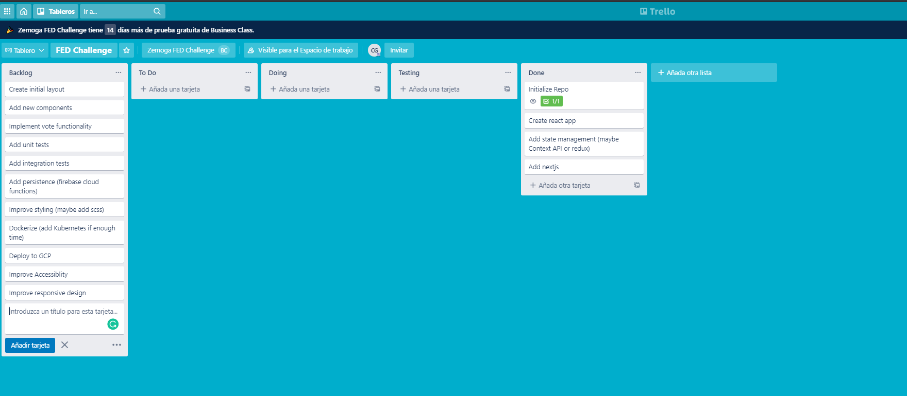
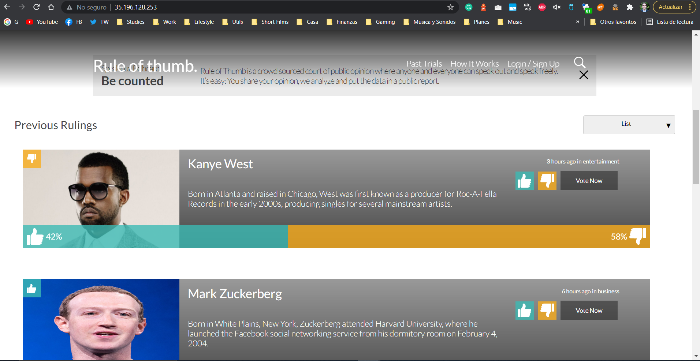
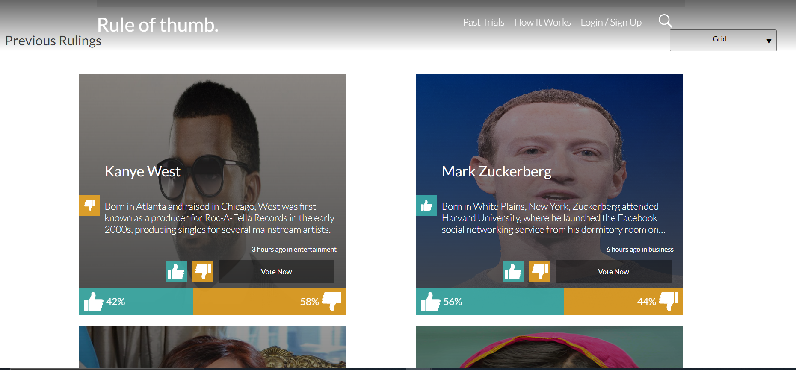
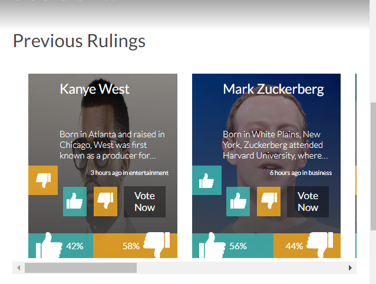
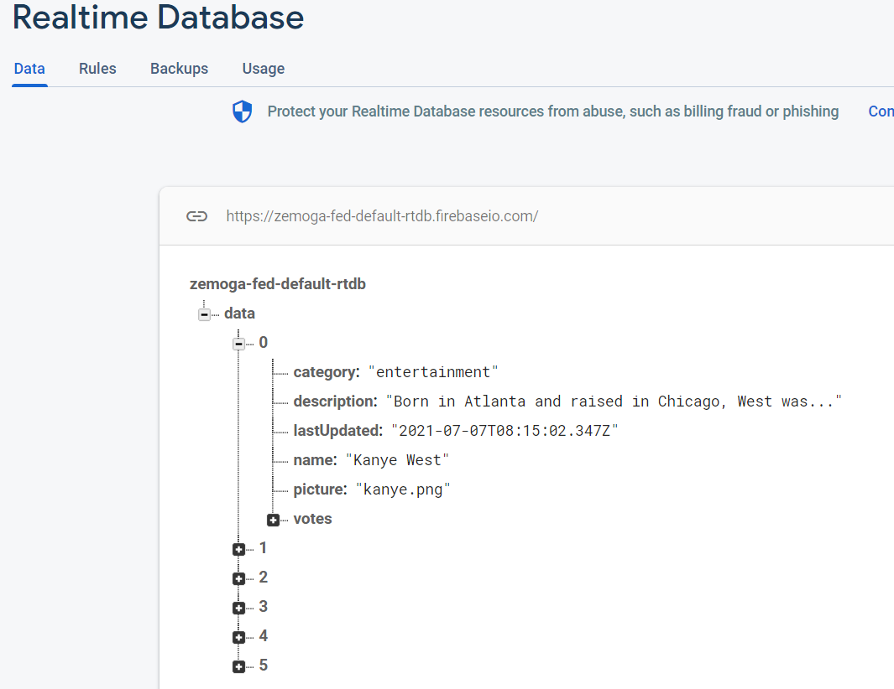
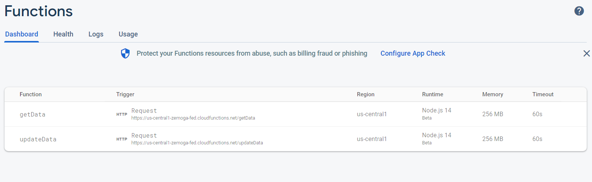
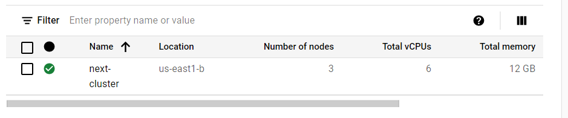

# rule-of-thumb
Zemoga Front end dev challenge

Initialized with starter template from [Learn Next.js](https://nextjs.org/learn).

## Trello Board

Here you will find a [Trello Board](https://trello.com/b/EpCUpeKr/fed-challenge) with all the tasks implemented for this challenge

## Functionality

In order to check the finished product, there is a public website available [here](http://35.196.128.253/)

### List View

### Grid View

### Mobile View

## Persistance

Implemented serverless firebase functions in order to retrieve data from a realtime database

### Realtime DB

### Serverless functions

- getData retrieves the entire document to be able to show it when the page renders

- updateData updated the whole document to be able to modify attributes such as votes and the lastUpdated variable.

## Other Notable Features

- [x] Developed entirely on Reactjs with Typescript + State Management

    Used modern react features such as hooks. The useContext hook acts as a state manager similar to Redux.

- [x] SEO Friendly

    Used Server Side Rendering with NestJS to increase the SEO of the website.

- [x] Implemented unit tests 

    Used Jest to develop unit tests for the application.

- [x] Accesibility

    All images have their descriptive alt. Colors are always contrasting so visually impaired people can see clearly what's happening.

- [x] Serverless functions

    The serverless functions are available to check inside the `/functions` folder. 

- [x] Docker + Kubernetes

    The website is running inside a Kubernetes cluster, with the Docker containers in 3 Compute instances, configured to do load balancing.

    

- [x] Different envs & Production ready

    All NestJS configurations are set up to be as efficient as posible in terms of loading times on production. It also has environment variable files for development.

## How to run it?

After cloning the project, there are two main ways to run the project: 

### 1. Manually, for development

- Install dependencies with `npm install`

- Run the project with `npm run dev`

### 2. Docker, for building and deploying

- Instantly build the website with docker using `docker build {containerName} .`

- Run the docker container locally with `docker run --rm -p 3000:3000 {containerName}`

